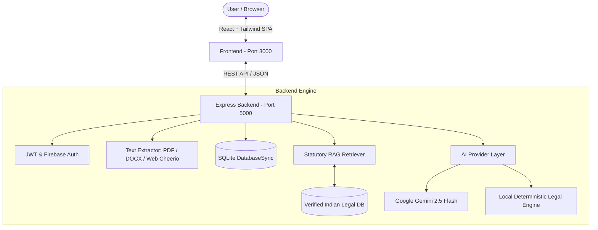

# ⚖️ LegalLens — GenAI Plain-Language Legal Awareness Platform

<div align="center">

> **"Understand Before You Agree."**  
> *Transforming dense Terms & Conditions, complex contracts, and statutory legal queries into plain-English, actionable clarity.*

[](https://nodejs.org/)
[](https://reactjs.org/)
[](https://vitejs.dev/)
[](https://tailwindcss.com/)
[](https://sqlite.org/)
[](https://firebase.google.com/)
[](LICENSE)

</div>

---

## 📖 Table of Contents
1. [Platform Overview](#-platform-overview)
2. [Key Features & Capabilities](#-key-features--capabilities)
3. [Technology Stack](#-technology-stack)
4. [System Architecture](#-system-architecture)
5. [Verified Indian Statutory Sources (RAG)](#-verified-indian-statutory-sources-rag)
6. [Project Directory Structure](#-project-directory-structure)
7. [Getting Started & Local Setup](#-getting-started--local-setup)
8. [Environment Variables](#-environment-variables)
9. [Database Schema & Persistence](#-database-schema--persistence)
10. [Multilingual Support (8 Indian Languages)](#-multilingual-support-8-indian-languages)
11. [Legal Disclaimers & Ethical Guidelines](#-legal-disclaimers--ethical-guidelines)

---

## 🌟 Platform Overview

**LegalLens** is an AI-powered legal awareness web application designed to bridge the massive information gap between everyday users and dense legal text. Whether someone is subscribing to a SaaS product, signing a residential rental agreement, reviewing an employment contract, or inquiring about their statutory consumer rights, LegalLens provides immediate, plain-language breakdowns cross-referenced with verified statutory citations.

### Core Problems LegalLens Solves:
* **The "I Agree" Blindspot:** Average users sign 30+ legal agreements each year without reading 15+ pages of dense clauses hiding automatic renewals, unilateral fee adjustments, and mandatory foreign arbitration.
* **Legal Jargon Overload:** Complex Latin terms like *indemnification*, *force majeure*, and *severability* confuse users about their true liabilities.
* **LLM Hallucinations in Law:** Traditional chat models often invent non-existent laws. LegalLens solves this with **strict document grounding** and an **indexed statutory RAG engine**.

---

## 🚀 Key Features & Capabilities

### 1. 🔍 Terms & Conditions Analyzer (`/terms`)
* **URL Content Extraction:** Paste any live website URL (e.g. cloud services, e-commerce, social apps). Cheerio parses and cleans DOM text with fallback to common policy anchors.
* **Direct Text Input:** Paste arbitrary agreement text, privacy policies, or subscription terms.
* **Plain-English "What Am I Agreeing To?" Card:** Highlights the exact bottom-line rights you forfeit and obligations you undertake.
* **Categorized Clause Breakdown:**
  * 🔄 **Auto-Renewals & Billing Cycles:** Highlights cancellation notice windows and recurring payment triggers.
  * 🛡️ **Data Privacy & Telemetry:** Discloses third-party sharing, cookie profiling, and cross-border transfers.
  * ⚖️ **Dispute Resolution & Jurisdiction:** Flags mandatory arbitration clauses, class-action waivers, and foreign jurisdiction clauses.
  * 🚫 **Liability Limitations:** Uncovers unilateral termination rights and damages caps.
* **Document Risk Scorecard:** High/Medium/Low overall risk calculation based on clause severity.
* **Action Checklist & Timeline:** Concrete list of dates, records to download, and cancellation steps.
* **Lawyer Consultation Prep:** Auto-generates exact, highly targeted questions to ask a qualified advocate.
* **1-Click Instant Demos:** Pre-loaded samples (CloudScale SaaS Terms, Tenancy Lease, Employment Agreement) for instant demonstration.

---

### 2. 🧠 Statutory Legal Knowledge Assistant (`/legal-assistant`)
* **Source-Grounded RAG Pipeline:** Users ask everyday questions (e.g., *"Can my landlord deduct my entire security deposit for normal wear and tear?"*, *"Is a 2-year non-compete enforceable in India?"*).
* **Jurisdiction & State Filtering:** Tailors statutory provisions based on the selected Indian State (Telangana, Maharashtra, Karnataka, Delhi, Tamil Nadu, etc.).
* **Category Auto-Detection:** Classifies inquiries across **Rental & Tenancy**, **Consumer Protection**, **Cyber & DPDP**, **Employment & Labor**, and **Contract Law**.
* **Statutory Section Citations:** Returns the verified Act name, Section number, and official legal excerpt.
* **Voice Input & Speech Output:** Full speech-to-text voice questions and natural audio speech synthesis with pitch/rate controls.

---

### 3. 📄 Document Upload & Grounded Q&A (`/upload`)
* **Multi-Format Parsing:** Drag-and-drop support for **PDF** (via `pdf-parse`), **Word DOCX** (via `mammoth`), and **Plain Text (TXT)**.
* **Metadata & Document Summary:** Computes character counts, structural sections, and executive summaries.
* **Strictly Grounded Document Chat:** Interactive multi-turn chat assistant that answers questions exclusively using uploaded document text.
* **Anti-Hallucination Guarantee:** If a clause or detail is absent from the file, the engine explicitly states: *"That information does not appear to be stated in the document."*

---

### 4. ⚖️ Semantic Document Comparison (`/compare`)
* **Counter-Offer & Version Diffing:** Compare original contracts against revised versions (e.g. Tenant vs. Landlord revisions, Employer vs. Employee counter-proposals).
* **Semantic Analysis Beyond Character Diffs:** Detects substantive changes in obligations, modified liability amounts, deleted protections, and newly introduced covenants.
* **Clause-by-Clause Impact Ratings:** Flags whether each edit favors Party A or Party B with plain-language explanations.

---

### 5. 📚 Plain Legal Glossary — Jargon Buster (`/glossary`)
* **40+ Curated Legal Terms:** Comprehensive encyclopedia decoding terms like *Indemnity*, *Force Majeure*, *Severability*, *Liquidated Damages*, *Quiet Enjoyment*, *Arbitration*, *Non-Solicitation*, and *Subrogation*.
* **Real-World Scenarios:** Every term includes a plain-English translation, an everyday story/example, risk level badge, and statutory cross-reference.
* **Interactive Filtering:** Filter by category (Contracts, Real Estate, Employment, Privacy, Consumer) or risk level (High / Moderate / Standard).
* **Flashcard Quiz & Printable Mode:** Flip cards to test legal vocabulary or generate a print-ready legal cheat sheet.

---

### 6. 📊 Personal Workspace & Dashboard (`/dashboard`)
* **Key Metric Summary Cards:** Real-time counters for Total Analyses, Saved in Library, Terms & Policies, and Uploads & Queries.
* **Search & Type Filters:** Instant client-side search across past reports by title, URL, or analysis type.
* **Library Management:** 1-click bookmarking to save critical contracts, and safe permanent deletion.
* **Responsive Zero-Collision UI:** Fully responsive design with non-overlapping action buttons and bottom clearance.

---

### 7. 🤖 Context-Aware AI Copilot (`LegalLensAgent.jsx`)
* **Floating Assistant:** Available across all pages to guide users through complex workflows.
* **Route Awareness:** Automatically adjusts prompt suggestions and tips based on whether the user is analyzing terms, uploading files, or exploring the glossary.
* **Quick Query Capabilities:** Ask quick procedural questions directly from any page.

---

### 8. 🌐 8 Indian Regional Languages + English
* **Supported Languages:**
  * 🇬🇧 English
  * 🇮🇳 Hindi (हिंदी)
  * 🇮🇳 Telugu (తెలుగు)
  * 🇮🇳 Tamil (தமிழ்)
  * 🇮🇳 Kannada (ಕನ್ನಡ)
  * 🇮🇳 Malayalam (മലയാളം)
  * 🇮🇳 Marathi (मराठी)
  * 🇮🇳 Bengali (বাংলা)
* **Complete Localization:** Full UI headers, buttons, cards, disclaimer notices, and dynamic AI result translation.

---

## 🛠️ Technology Stack

### Frontend Architecture
| Technology | Version | Purpose |
| :--- | :--- | :--- |
| **React** | `18.3.1` | Component-based UI view layer |
| **Vite** | `6.1.1` | Fast HMR dev server & optimized production bundler |
| **Tailwind CSS** | `3.4.17` | Responsive styling, Neo-Brutalist design tokens, custom color palettes |
| **Lucide React** | `1.16.0` | Accessible, crisp icon library |
| **React Router DOM** | `6.29.0` | Client-side routing, route guards, and URL query params |
| **Axios** | `1.7.9` | HTTP client for backend REST communication |
| **Firebase JS SDK** | `12.19.0` | Client Google OAuth popup & user state tracking |
| **Web Speech API** | Native Browser | Voice input (speech recognition) & audio synthesis |

---

### Backend Architecture
| Technology | Version | Purpose |
| :--- | :--- | :--- |
| **Node.js** | `v18+` / `v24` | JavaScript server runtime environment |
| **Express.js** | `4.21.2` | RESTful API routing, controllers, and middleware |
| **`node:sqlite`** | Native | Synchronous, embedded SQLite database (`DatabaseSync`) |
| **Multer** | `1.4.5-lts.1` | Multi-part file upload processing (PDF, DOCX, TXT) |
| **pdf-parse** | `1.1.1` | Native PDF stream text extraction |
| **mammoth** | `1.9.0` | Microsoft Word (`.docx`) text extraction |
| **cheerio** | `1.0.0` | Server-side DOM parsing & terms web scraper |
| **jsonwebtoken** | `9.0.2` | Stateless authentication tokens |
| **bcryptjs** | `2.4.3` | Secure password hashing |
| **cors** & **dotenv** | `2.8.5` / `16.4.7` | Cross-Origin resource sharing & environment loading |

---

### AI & Retrieval Engine
| Component | Implementation | Description |
| :--- | :--- | :--- |
| **GeminiProvider** | `@google/genai` / HTTP | Google Gemini 2.5 Flash API for multimodal & text reasoning |
| **MockProvider** | Local Deterministic Engine | Zero-config offline legal parsing engine (no API key required) |
| **RAG Retriever** | BM25 + Keyword Scoring | Section-level statutory index matching across verified Acts |

---

## 🏛️ System Architecture



---

## 📜 Verified Indian Statutory Sources (RAG)

LegalLens includes structured statutory indexes stored under `data/legal-sources/india/`:

* 🛒 **Consumer Rights:**
  * *Consumer Protection Act, 2019* (Unfair contract terms, misleading ads, product liability)
  * *Consumer Protection (E-Commerce) Rules, 2020* (Mandatory refund policies, ticket tracking)
* 🔒 **Data Privacy & Cyber:**
  * *Digital Personal Data Protection Act, 2023 (DPDP Act)* (Consent notice, data fiduciary obligations, erasure rights)
  * *Information Technology Act, 2000 & 2011 Rules* (Reasonable security practices)
* 🏠 **Rental & Tenancy:**
  * *Model Tenancy Act, 2021* (Security deposit caps: max 2 months for residential, notice rules)
  * *Transfer of Property Act, 1882* (Section 108 Rights and Liabilities of Lessor & Lessee)
* 💼 **Employment & Labor:**
  * *Payment of Gratuity Act, 1972* (Eligibility, 5-year calculation rules)
  * *State Shops and Commercial Establishments Acts* (Leave policies, maximum work hours, termination notice)
* 📝 **General Contract Law:**
  * *Indian Contract Act, 1872* (Section 10 Free Consent, Section 27 Restraint of Trade / Non-competes, Section 73/74 Breach & Liquidated Damages)

---

## 📂 Project Directory Structure

```text
pw/
├── frontend/                         # React 18 SPA (Vite + Tailwind CSS)
│   ├── src/
│   │   ├── components/               # UI Cards, Glossary Modal, Agent, Scorecard, Navbar, Footer
│   │   ├── config/                   # Firebase initialization & GoogleAuthProvider setup
│   │   ├── context/                  # AuthContext, LanguageContext, and translation dictionaries
│   │   ├── data/                     # Legal Glossary dataset (40+ terms)
│   │   ├── layouts/                  # MainLayout with Sticky Navbar and Agent wrapper
│   │   ├── pages/                    # TermsAnalyzer, LegalAssistant, Upload, Compare, Glossary, Dashboard, Login, Register
│   │   ├── services/                 # Axios API endpoints
│   │   ├── App.jsx                   # React Router DOM route declarations
│   │   └── main.jsx                  # React application entry point
│   ├── package.json
│   └── vite.config.js
│
├── backend/                          # Express.js REST API Server
│   ├── src/
│   │   ├── config/                   # Database (SQLite), environment config, index.js
│   │   ├── controllers/              # Auth, Terms, Legal, Document, Comparison, Dashboard handlers
│   │   ├── middleware/               # JWT authentication guard & centralized error handler
│   │   ├── routes/                   # REST API routes (/api/terms, /api/legal, /api/auth, etc.)
│   │   ├── services/
│   │   │   ├── ai/                   # GeminiProvider & MockProvider implementations
│   │   │   ├── rag/                  # Statutory knowledge base & BM25 keyword retriever
│   │   │   ├── document/             # PDF, DOCX, and TXT extractors & section chunker
│   │   │   ├── comparison/           # Semantic diff and clause alteration scorer
│   │   │   └── legal/                # Jurisdiction & category classification engine
│   │   ├── app.js                    # Express app configuration & route registration
│   │   └── server.js                 # HTTP server bootstrap
│   └── package.json
│
├── data/
│   ├── legal-sources/                # Verified statutory legal JSON databases
│   │   └── india/                    # Consumer, Contracts, Cyber, Employment, Rental provisions
│   └── demo-documents/               # Sample Terms, Leases, and Employment Agreements
│
├── .env.example                      # Template for environment configuration
├── package.json                      # Workspace root scripts
└── README.md                         # Complete project documentation
```

---

## 💻 Getting Started & Local Setup

### 1. Prerequisites
* **Node.js**: `v18.0.0` or higher (`Node 24` recommended; includes native `node:sqlite`)
* **npm**: `v9.0.0` or higher

---

### 2. Installation
From the project root:

```bash
# 1. Install Backend Dependencies
cd backend
npm install

# 2. Install Frontend Dependencies
cd ../frontend
npm install

# 3. Return to workspace root
cd ..
```

---

### 3. Environment Setup
Create a `.env` file in the project root:
```bash
cp .env.example .env
```

*(See [Environment Variables](#-environment-variables) below for optional configuration)*

---

### 4. Running the Application

You can launch both servers simultaneously or in separate terminal windows:

#### Terminal 1: Start Backend API Server
```bash
npm run dev:backend
# or: node backend/src/server.js
```
> *Backend runs at:* `http://localhost:5000`

#### Terminal 2: Start Frontend Web Application
```bash
npm run dev:frontend
# or: cd frontend && npm run dev
```
> *Frontend opens at:* `http://localhost:3000`

Open your browser and navigate to **`http://localhost:3000`**.

---

## 🔐 Environment Variables

| Variable | Description | Default / Example |
| :--- | :--- | :--- |
| `PORT` | Backend server port | `5000` |
| `AUTH_SECRET` | JWT secret key for token generation | `legallens-secret-local-dev-2026` |
| `DATABASE_URL` | SQLite database file location | `sqlite://backend/legallens.sqlite` |
| `AI_PROVIDER` | AI engine to use: `mock` or `gemini` | `mock` *(auto-switches to gemini if key present)* |
| `AI_API_KEY` | Google Gemini API key | *Optional (leave blank for local mock)* |
| `AI_MODEL` | Gemini model name | `gemini-2.5-flash` |
| `DEFAULT_JURISDICTION` | Primary target legal jurisdiction | `india` |

> 💡 **Zero-Config Local Mode:** If `AI_API_KEY` is omitted, LegalLens automatically runs its internal deterministic legal analysis engine. You get realistic plain-language breakdowns, obligation mapping, and grounded answers without needing an external API key.

---

## 🗄️ Database Schema & Persistence

LegalLens utilizes an embedded SQLite database (`backend/legallens.sqlite`) managed via Node's native `node:sqlite` (`DatabaseSync`):

```sql
-- Users Table
CREATE TABLE IF NOT EXISTS users (
  id TEXT PRIMARY KEY,
  name TEXT NOT NULL,
  email TEXT NOT NULL UNIQUE,
  password_hash TEXT NOT NULL,
  created_at TEXT NOT NULL
);

-- Analyses Table
CREATE TABLE IF NOT EXISTS analyses (
  id TEXT PRIMARY KEY,
  user_id TEXT,
  type TEXT NOT NULL,
  title TEXT NOT NULL,
  source_type TEXT NOT NULL,
  source_url TEXT,
  raw_text TEXT,
  structured_result TEXT NOT NULL,
  is_saved INTEGER DEFAULT 0,
  created_at TEXT NOT NULL,
  updated_at TEXT NOT NULL,
  FOREIGN KEY (user_id) REFERENCES users (id) ON DELETE CASCADE
);

-- Chat Messages for Grounded Q&A
CREATE TABLE IF NOT EXISTS chat_messages (
  id TEXT PRIMARY KEY,
  analysis_id TEXT NOT NULL,
  user_id TEXT,
  role TEXT NOT NULL,
  content TEXT NOT NULL,
  citations TEXT,
  created_at TEXT NOT NULL,
  FOREIGN KEY (analysis_id) REFERENCES analyses (id) ON DELETE CASCADE
);
```

---

## 🌍 Multilingual Support (8 Indian Languages)

LegalLens features built-in translations for 8 Indian regional languages. Users can switch their preferred language anytime using the language selector in the navigation bar:

| Language | Native Script | Coverage |
| :--- | :--- | :--- |
| **English** | English | Complete UI & Analysis Engine |
| **Hindi** | हिन्दी | Navigation, Headers, Disclaimers, AI Outputs |
| **Telugu** | తెలుగు | Navigation, Headers, Disclaimers, AI Outputs |
| **Tamil** | தமிழ் | Navigation, Headers, Disclaimers, AI Outputs |
| **Kannada** | ಕನ್ನಡ | Navigation, Headers, Disclaimers, AI Outputs |
| **Malayalam** | മലയാളം | Navigation, Headers, Disclaimers, AI Outputs |
| **Marathi** | मराठी | Navigation, Headers, Disclaimers, AI Outputs |
| **Bengali** | বাংলা | Navigation, Headers, Disclaimers, AI Outputs |

---

## 🧪 Automated Testing & Quality Assurance

LegalLens maintains a comprehensive, production-grade automated testing suite spanning both backend services and frontend user interfaces:

```bash
# Run all backend unit, integration, and security tests (Jest)
npm run test

# Run all frontend component and legal simplifier tests (Vitest)
npm run test --prefix frontend
```

### Test Coverage Highlights:
* **Terms Analysis Engine (`backend/tests/terms.test.js`)**: Validates clause extraction for recurring billing, arbitration, telemetry/privacy, and liability disclaimers, with edge-case checks for invalid document lengths.
* **Statutory RAG Pipeline (`backend/tests/rag.test.js`)**: Validates keyword scoring, relevance ranking, statutory section matching, and stop-word filtering across Indian statutory provisions.
* **Prompt Injection Defense (`backend/tests/terms.test.js`)**: Validates that system prompt overrides, DAN jailbreaks, instruction hijacking, and LLM control tokens are sanitized before prompt interpolation.
* **Database & Concurrency (`backend/tests/database.test.js`)**: Validates asynchronous non-blocking record creation, queries, report saving, and in-memory test isolation.
* **Security & Headers (`backend/tests/security.test.js`)**: Verifies Helmet protection headers (`nosniff`, `frameguard`, `dnsPrefetch`), route authentication guards, and 404 handlers.
* **Plain-English ELI5 Simplifier (`frontend/src/App.test.jsx`)**: Validates translation of complex legal jargon into 5th-grade English and structured breakdown generation.

---

## 🛡️ Security, Scalability & Concurrency Architecture

### 1. Multi-Layer Prompt Injection Sanitization
To prevent prompt injection, model jailbreaks, and delimiter hijacking from untrusted documents:
* **Token Stripping**: Automatically removes LLM control tokens (`<|im_start|>`, `[INST]`, `<<SYS>>`).
* **Jailbreak Filtering**: Neutralizes adversarial directives (`Ignore previous instructions`, `DAN mode`, `developer mode`).
* **Delimited Data Boundary**: Untrusted user documents are isolated inside `<untrusted_document_content>` tags with strict system prompt constraints forbidding instruction execution from within the document block.

### 2. Asynchronous Non-Blocking Database Architecture
To eliminate event loop blocking under heavy concurrent traffic:
* Database operations are executed using an **asynchronous event-loop yielding queue (`asyncExecute`)** powered by `setImmediate`.
* Long-running queries yield control back to the Node.js event loop, preventing event loop starvation.
* Includes both synchronous and asynchronous Promise-based APIs (`createUserAsync`, `createAnalysisAsync`, `findUserByEmailAsync`).

### 3. Production HTTP Hardening
* **Helmet Security Headers**: X-Content-Type-Options (`nosniff`), X-Frame-Options (`SAMEORIGIN`), X-DNS-Prefetch-Control.
* **Rate Limiting**: Protects AI endpoints against abuse with `express-rate-limit`.
* **Gzip/Brotli Compression**: `compression` middleware reduces payload sizes for rapid responsiveness.
* **In-Memory Query Caching**: Powered by `apicache` for high-throughput public endpoints.

---

<div align="center">

**LegalLens** — *Understand Before You Agree.*  
Built with ❤️ for accessible legal clarity and consumer empowerment.

</div>
